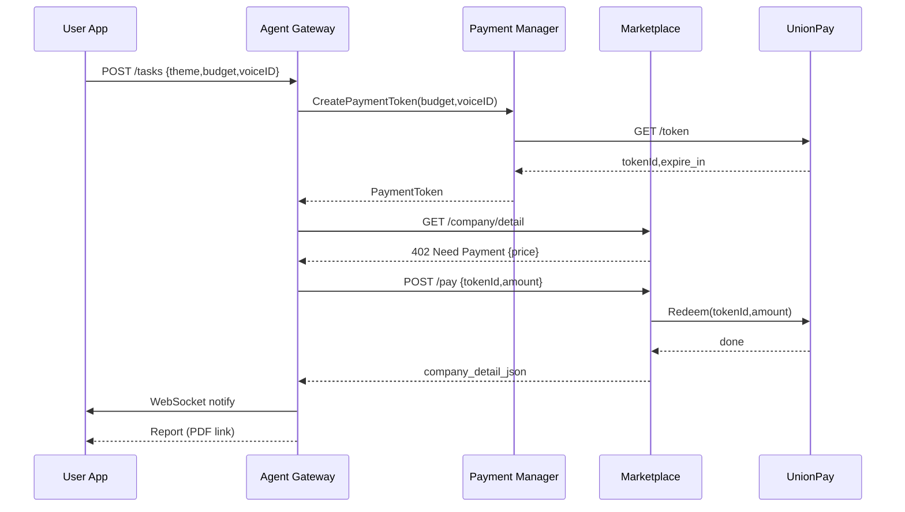

这是一个关于用户授权Agent获得Payment Token，Agent在做Deep Research的过程中，用Payment Token买企查查的企业信息服务，从而完成更高质量报告的过程
以下架构示意把 **「一句话→研究报告」** 的闭环拆成 4 大域、15 个核心组件。你可以把它部署在一套 K8s 集群里（或用多云 / 混合云），整体遵循 **事件驱动 + REST / Webhook + 零信任安全** 的思路。

---

## 1 ️⃣　用户侧应用域（App Domain）

| 组件                       | 关键职责                                                                         | 技术栈建议                           |
| ------------------------ | ---------------------------------------------------------------------------- | ------------------------------- |
| **A1 · 前端 App**          | ① 录音并生成 `voiceID`（SHA‑256 哈希） ② 任务表单：主题 + 预算 + 期望交付格式 ③ WebSocket 实时通知 | React / Flutter + Web Audio API |
| **A2 · Wallet UI**       | 展示可用余额、历史 Token、已完成报告                                                        | 同上                              |
| **A3 · Auth Gateway**    | OAuth 2.1 / OIDC，颁发 Access‑Token                                             | Keycloak / Auth0                |
| **A4 · VoiceID Service** | 与 KYC 库校验声纹，返回 `voiceID_verified=true`                                       | 基于 Kaldi / 腾讯云声纹 SDK            |

> **发起任务**：前端 `POST /tasks {theme, budget, voiceID}` → Auth Gateway 校验 → 投递消息到 *Agent Task‑Queue*。

---

## 2 ️⃣　Agent Domain（Research & Orchestration）

| 组件                         | 关键职责                                                                         | 技术栈建议                     |
| -------------------------- | ---------------------------------------------------------------------------- | ------------------------- |
| **B1 · Task Orchestrator** | 消费队列、拆分子任务、调度工作流                                                             | Temporal / Apache Airflow |
| **B2 · LLM Core**          | Prompt‑Engine、检索增强 (RAG)、总结报告                                                | OpenAI o3 / 自研 GLM        |
| **B3 · Memory Store**      | 短期记忆（Redis）+ 向量记忆（PGVector / Milvus）                                         |                           |
| **B4 · Payment Manager**   | ① 向 *Token‑Issuer* 申请 Payment Token ② 缓存于 Vault，附在后续付费请求 Header           | FastAPI + Vault           |
| **B5 · Research Worker**   | 按工作流访问电商 API： • 收到 HTTP 402 → 调*Payment Manager* 付费 • 解析数据 → 回写 Memory | FastAPI + Celery          |
| **B6 · Report Builder**    | 拼装 Markdown → PDF / HTML；可选 TTS 音频                                           | WeasyPrint / Pandoc       |

---

## 3 ️⃣　电商服务域（Marketplace Domain）

| 组件                           | 关键职责                                                                                         | 技术栈建议            |
| ---------------------------- | -------------------------------------------------------------------------------------------- | ---------------- |
| **C1 · Catalog Service**     | 免费层接口：`GET /company/basic`                                                                   | Node.js / NestJS |
| **C2 · Premium API**         | 深度数据：`GET /company/detail` • 若未携带 Token → 返回 **HTTP 402 Need Payment**，并在 Body 提供 `price` | 同上               |
| **C3 · Payment Endpoint**    | `POST /pay {tokenId, amount}` • 验签后将 `Redeem` 请求 proxy 给银联                                |                  |
| **C4 · Settlement Listener** | 接收银联 Webhook（扣款成功 / 失败），更新订单状态                                                               |                  |

---

## 4 ️⃣　支付服务域（UnionPay Domain）

| 组件                             | 关键职责                                                                                      | 参考接口 |
| ------------------------------ | ----------------------------------------------------------------------------------------- | ---- |
| **D1 · Token‑Issuer**          | `GET /upapi/.../token?app_id&app_secret` → 返回 `token, expire_in` ([open.unionpay.com][1]) |      |
| **D2 · Redeem API**            | 电商调用，用于扣减余额；字段服从 5.1.0 规范，核心参数写在 `tokenPayData` ([open.unionpay.com][2])                  |      |
| **D3 · Clearing & Settlement** | 账务入账、风控、监控                                                                                |      |

> ⚙️ **VoiceID 绑定**：在 *Token‑Issuer* 内部扩展一张表 `voiceID ↔ app_id ↔ KYC_ID`，确保刷声纹即可获取限额  Token。

---

## 端到端时序（概念版）

---

## 数据存储 & DevOps

| 层           | 数据库 / 存储                        | 备份策略           |
| ----------- | ------------------------------- | -------------- |
| 用户 & 任务     | PostgreSQL (主) + Timescale (日志) | PITR + WAL-G   |
| Token Vault | Hashicorp Vault + HSM           | 双活             |
| 向量检索        | Milvus / Weaviate               | 每日快照           |
| 报告文件        | S3 兼容对象存储                       | Lifecycle 90 d |

*CI/CD*：GitHub Actions → Argo CD
*Observability*：Prometheus / Grafana + OpenTelemetry

---

## MVP 实施里程碑

| Sprint  | 交付                        | 关键风险         |
| ------- | ------------------------- | ------------ |
| 1 (2 w) | A1‑A3、B1 雏形；可创建任务         | 声纹算法准确率      |
| 2 (2 w) | B4‑B5 接通测试银联，完成 402→付费→返回 | Token 额度风控   |
| 3 (3 w) | C1‑C3 上线；Agent 首版报告       | 企查查数据质量      |
| 4 (2 w) | D1‑D2 生产联调，整链压测           | 支付并发量        |
| 5 (1 w) | 安全审计 & 合规评估               | PCI DSS、数据出境 |
| 6 (1 w) | 发布 v1.0，启用自动化监控           | SLA 监控完整性    |

---

## 安全 & 合规要点

1. **零信任网关**：所有内部调用强制 mTLS + JWT。
2. **最小权限 Token**：token 仅含必要字段（额度、过期、签名），并采用 AES‑GCM 加密。
3. **双录日志**：支付路径全链路留存、不可篡改。
4. **合规**：遵循 **PCI DSS v4.0**；声纹模板做 irrecoverable hash，避免生物特征原始数据落盘。

---

### 一页总结

> **用户 App** → 声纹一句话下单 → **Agent** 自动申请银联 Payment Token → **电商 API** 遇 402 即付 → 数据回流 → **LLM** 汇总成报告 → WebSocket 告知用户。
>
> 架构解耦、接口标准、Token 离线，既保证 **极低的人机交互摩擦**，又兼顾 **额度安全** 与 **合规审计**。

[1]: https://open.unionpay.com/tjweb/api/interface?apiSvcId=3191&id=19841&utm_source=chatgpt.com "获取token - 中国银联开放平台"
[2]: https://open.unionpay.com/tjweb/acproduct/APIList?acpAPIId=818&apiservId=449&bussType=0&utm_source=chatgpt.com "银联全渠道支付开通交易(订单号申请Token)"
